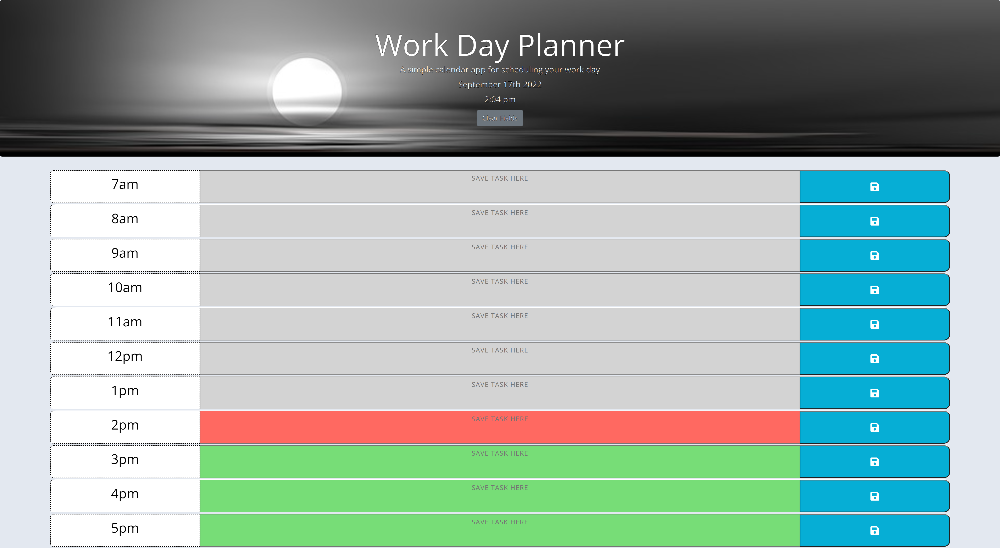

# Workday Planner

## Table of Contents
- [Description](#description)
- [Link to Website](#website-link)
- [Github Repository](#github-repo)
- [Screenshot](#screenshot)
- [Liscense](#license)

#
#
### Description
#### The goal was to create an easy to use day planner to organize a busy schedule. Moment JS is used to provide real-time data to page and to display past, present, and future tasks. The user is able to fill in time blocks with tasks for the day and save them to local storage. Local storage items are stamped with time slot so if user refreshes or navigates away from page, items are kept in desired time slot.

#

### Link to Website: [Workday Planner](https://yogibruce.github.io/workdayPlanner/)

### Github Repository: [Workday Planner repo](https://github.com/YogiBruce/workdayPlanner)

#
### Screenshot

#
### License [MIT](http://choosealicense.com/licenses/mit/)